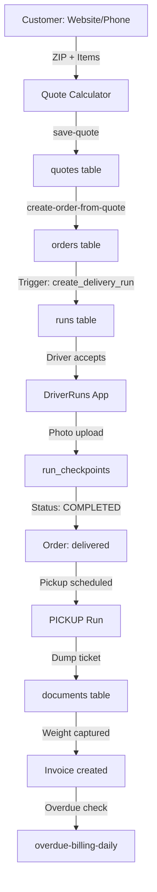
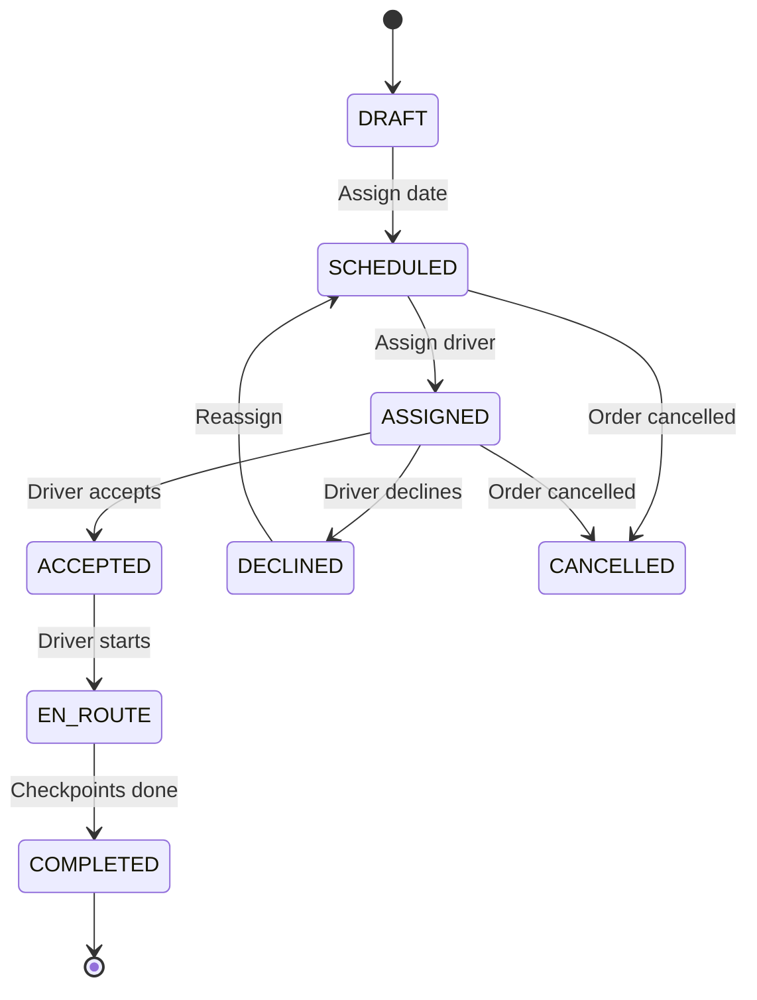

# 🏗️ CALSAN WASTE MANAGEMENT - SYSTEM AUDIT REPORT

**Fecha de Auditoría:** 2026-01-27  
**Versión del Sistema:** v58 (Go-Live Ready)  
**Auditor:** Engineering Autopilot  
**Scope:** Full-stack review (Product, Data, Pricing, Dispatch, Security, Reliability)

---

## 📊 EXECUTIVE SUMMARY (10 Bullets)

1. **GO-LIVE READY** - El sistema está arquitectónicamente sólido con 141 tablas, 49 Edge Functions, y un modelo de datos completo para waste management.

2. **PRICING ENGINE ROBUSTO** - El motor v58 está correctamente versionado en `shared-data.ts` con reglas claras: $165/ton overage (General), flat-fee con fill-line (Heavy).

3. **DISPATCH SYSTEM COMPLETO** - Sistema de Runs con lifecycle completo (DRAFT→COMPLETED), proof-of-service obligatorio, y integración con driver app.

4. **SECURITY POSTURE SÓLIDO** - RBAC implementado con `has_role()` SECURITY DEFINER, RLS habilitado en tablas críticas, aunque hay 4 políticas permisivas que requieren revisión.

5. **TELEPHONY EN MIGRACIÓN** - Sistema híbrido GHL→Twilio con dual-ring/forward method. Modo DRY_RUN activo.

6. **OMNICHANNEL LEADS** - 15 canales de captura con deduplicación 30 días, clasificación AI (Gemini), y routing automático Sales/CS.

7. **HEAVY MATERIALS WELL-MODELED** - `heavy_material_profiles`, `heavy_weight_rules`, estimación de tonnage con `estimate_heavy_weight()`, y reclassificación automática por contaminación.

8. **DRIVER APP FUNCIONAL** - Vista mobile-optimized con checkpoints, foto upload, navegación GPS, pero falta offline sync y firma digital.

9. **BILLING AUTOMATIZADO** - `overdue-billing-daily` con incremental billing, policy gating por customer type, y approval workflow para charges >$250.

10. **RIESGO PRINCIPAL** - Leaked Password Protection deshabilitado, extensión pg_net en schema public, y 4 RLS policies con `USING(true)` en INSERT.

---

## 🎯 SCORECARD (0-10)

| Capa | Score | Justificación |
|------|-------|---------------|
| **PRODUCT & WORKFLOWS** | 8/10 | Flujos completos Quote→Order→Dispatch→Invoice. Falta: offline driver mode, signature capture, OCR dump tickets. |
| **DATA MODEL** | 9/10 | 141 tablas bien normalizadas, Source of Truth claro (`assets_dumpsters`, `market_rates`). Minor: naming inconsistente en algunos campos JSON. |
| **PRICING ENGINE** | 9/10 | Versionado, audit trail en `config_versions`, cálculo reproducible. Falta: test suite automatizado. |
| **DISPATCH/DRIVER** | 7/10 | Runs system completo, pero sin GPS tracking en tiempo real, sin offline sync, sin firma digital. |
| **SECURITY** | 7/10 | RBAC sólido, RLS mayormente correcto. Deuda: 4 policies permisivas, leaked password protection off. |
| **RELIABILITY** | 6/10 | Audit logs existen, pero no hay test suite e2e, ni monitoring automatizado de órdenes stuck. |

**SCORE GLOBAL: 7.7/10** - Listo para soft launch con supervisión activa.

---

## 🔍 CAPA 1 — PRODUCT & WORKFLOWS

### Happy Path: Quote → Order → Dispatch → Ticket → Invoice



### Top 15 Puntos de Falla en Campo

| # | Punto de Falla | Impacto | Status Actual |
|---|----------------|---------|---------------|
| 1 | Driver pierde conexión durante foto upload | Foto perdida, run no cierra | ❌ No hay offline queue |
| 2 | Peso del ticket no coincide con estimado | Billing dispute | ⚠️ Manual review required |
| 3 | Dumpster bloqueado en delivery | Trip fee dispute | ✅ `trip-fee` extra existe |
| 4 | Customer no firma contrato | Legal exposure | ❌ No hay signature capture |
| 5 | Asset asignado pero no existe físicamente | Delivery fallida | ⚠️ Inventory sync manual |
| 6 | Dispatcher asigna wrong size | Customer frustration | ✅ Recommendation engine |
| 7 | Heavy material en dumpster general | Overage inesperado | ✅ Reclassification flow |
| 8 | Overdue billing sobre homeowner | Customer complaint | ✅ Policy gating |
| 9 | Ticket OCR falla | Manual entry required | ❌ OCR no implementado |
| 10 | Driver marca completado sin foto | No proof of service | ✅ Checkpoint required |
| 11 | Yard sin inventory suficiente | Delivery delayed | ⚠️ Alert exists, no auto-rebalance |
| 12 | Customer cancela después de delivery | Asset stranded | ✅ Cancellation triggers run |
| 13 | Duplicate lead ingresa | Wasted sales effort | ✅ 30-day dedup |
| 14 | Wrong facility selected (non-certified) | Compliance violation | ✅ City rules enforced |
| 15 | Payment fails after service | AR exposure | ✅ AR actions table |

### UX Gaps por Rol

**Dispatcher:**
- ✅ Calendar view con drag-drop (DispatchRunsCalendar)
- ✅ Driver suggestion basada en workload
- ⚠️ Falta: real-time GPS de trucks
- ⚠️ Falta: bulk assignment tool

**Driver:**
- ✅ Mobile-optimized runs view
- ✅ Photo upload con camera
- ✅ Navigation integration
- ❌ Falta: offline sync
- ❌ Falta: signature capture
- ❌ Falta: barcode/QR scan de asset

**Accounting:**
- ✅ Overdue billing dashboard
- ✅ Invoice line items detail
- ⚠️ Falta: QuickBooks sync
- ⚠️ Falta: batch invoicing

---

## 🗃️ CAPA 2 — DATA MODEL & CONSISTENCIA

### Source of Truth por Entidad

| Entidad | Table Principal | Status |
|---------|-----------------|--------|
| Customer | `customers` | ✅ |
| Order | `orders` | ✅ |
| Quote | `quotes` | ✅ |
| Asset (Dumpster) | `assets_dumpsters` | ✅ |
| Pricing | `dumpster_sizes` + `market_rates` | ✅ |
| Pricing Rules | `config_settings` | ✅ |
| Invoice | `invoices` + `invoice_line_items` | ✅ |
| Dispatch | `runs` + `run_checkpoints` | ✅ |
| Lead | `sales_leads` | ✅ |
| Facility | `facilities` | ✅ |

### Hallazgos del Data Model

| Hallazgo | Tabla | Severidad | Fix |
|----------|-------|-----------|-----|
| Campo `asset_id` duplicado en `orders` (también existe `primary_dumpster_id`) | orders | P2 | Deprecate `asset_id`, use only `primary_dumpster_id` |
| Inconsistencia: `user_id` en customers no es nullable pero puede ser placeholder | customers | P2 | Add `is_phone_only_customer` flag |
| `call_source` default 'NATIVE' pero GHL forwards use 'GHL_FORWARD' | call_events | P3 | Documented, OK |
| `market_id` es TEXT en algunos tables, UUID en otros | multiple | P2 | Standardize to TEXT slug |
| `heavy_material_code` en orders sin FK a `heavy_material_profiles` | orders | P3 | Add FK constraint |

### Esquema Ideal (MVP vs V2)

**MVP (Current - OK):**
- 141 tables es excesivo pero manejable
- Core entities bien definidas
- Relationships via FK funcionan

**V2 (Escalable):**
```sql
-- Propuestas:
-- 1. Consolidar material_types + material_catalog en una sola tabla
-- 2. Crear view `order_summary_vw` para queries comunes
-- 3. Agregar `job_costing` table para P&L por order
-- 4. Agregar `asset_maintenance_log` para preventive maintenance
```

---

## 💰 CAPA 3 — PRICING ENGINE & VERSIONING

### Arquitectura Actual

```
shared-data.ts (MASTER)
    ├── DUMPSTER_SIZES_DATA[]
    ├── PRICING_POLICIES{}
    ├── getPublicPriceRange()
    └── OVERAGE_NOTE
           │
           ▼
   config_settings (DB)
    ├── pricing.version = "2026_Q1_MARKET_STUDY"
    ├── pricing.default_tier_web = "BASE"
    └── pricing.extra_ton_rate_default = 165
           │
           ▼
    dumpster_sizes (DB)
    ├── base_price per size
    └── included_tons per size
           │
           ▼
    market_rates (DB)
    ├── heavy_base_10yd = 638
    └── extra_ton_rate_standard = 165
```

### Validación de Pricing

| Regla | Implementación | Test |
|-------|----------------|------|
| General overage = $165/ton | ✅ `PRICING_POLICIES.overagePerTonGeneral` | ⚠️ Manual |
| Heavy = flat fee with fill-line | ✅ `heavy_material_profiles.recommended_fill_pct` | ⚠️ Manual |
| Zone multiplier applies to base | ✅ `PRICING_ZONES[].baseMultiplier` | ⚠️ Manual |
| Extended rental = $35/day | ✅ `PRICING_POLICIES.extraDayCost` | ⚠️ Manual |
| Prepay discount = 5% | ✅ `market_rates.prepay_discount_pct` | ⚠️ Manual |

### Audit Trail

- ✅ `config_versions` captura cambios a pricing settings
- ✅ `quote.subtotal` snapshot del precio calculado
- ⚠️ Falta: `quote.pricing_rules_applied` JSON para reproducibilidad perfecta

### Pricing Bugs Clásicos - Status

| Bug Potencial | Status | Mitigación |
|---------------|--------|------------|
| Fees duplicadas | ✅ No existe | Extras son unique por ID |
| Condiciones contradictorias | ⚠️ Posible | Heavy size limit enforced in UI |
| Tons/days mal aplicados | ✅ Validated | `INCLUDED_TONS_BY_SIZE` lookup |
| Rounding inconsistente | ⚠️ Posible | `Math.round()` usado inconsistentemente |
| Tax not handled | ✅ Documented | "Prices before tax" disclaimer |

### Recomendación: Pricing Test Suite

```typescript
// Propuesta: src/lib/__tests__/pricing.test.ts
describe('Pricing Engine v58', () => {
  test('General debris 10yd Zone 1 = $580', () => {
    const result = calculateQuote({ zip: '94601', size: 10, material: 'general' });
    expect(result.subtotal).toBe(580);
  });
  
  test('Heavy 10yd gets fill-line enforcement', () => {
    const result = calculateQuote({ zip: '94601', size: 10, material: 'heavy' });
    expect(result.requiresFillLine).toBe(true);
  });
  
  test('Overage is exactly $165/ton', () => {
    expect(PRICING_POLICIES.overagePerTonGeneral).toBe(165);
  });
});
```

---

## 🚚 CAPA 4 — DISPATCH / DRIVER PROOF OF SERVICE

### Estados del Run Lifecycle



### Checklist Operativo por Stop

**DELIVERY Run:**
| Checkpoint | Required | Photo | Signature | GPS |
|------------|----------|-------|-----------|-----|
| DELIVERY_POD | ✅ | ✅ | ❌ | ⚠️ Browser |

**PICKUP Run:**
| Checkpoint | Required | Photo | Signature | GPS |
|------------|----------|-------|-----------|-----|
| PICKUP_POD | ✅ | ✅ | ❌ | ⚠️ Browser |
| DUMP_TICKET | ✅ | ✅ | ❌ | ⚠️ Browser |

**HAUL Run:**
| Checkpoint | Required | Photo | Signature | GPS |
|------------|----------|-------|-----------|-----|
| PICKUP_POD | ✅ | ✅ | ❌ | ⚠️ |
| DUMP_TICKET | ✅ | ✅ | ❌ | ⚠️ |
| SCALE_TICKET | ✅ | ✅ | ❌ | ⚠️ |

### Gaps en Driver Flow

| Feature | Status | Priority |
|---------|--------|----------|
| Photo upload | ✅ Working | - |
| Navigation button | ✅ Working | - |
| Checkpoint validation | ✅ Working | - |
| Offline photo queue | ❌ Missing | P1 |
| Digital signature | ❌ Missing | P1 |
| Asset barcode scan | ❌ Missing | P2 |
| GPS auto-capture | ⚠️ Browser API only | P2 |
| OCR dump ticket | ❌ Missing | P2 |
| Push notifications | ❌ Missing | P2 |

---

## 🔐 CAPA 5 — SECURITY / PERMISSIONS / AUDIT LOGS

### RBAC Implementation

```sql
-- Current Roles (app_role enum):
-- 'admin', 'moderator', 'user', 'sales', 'cs', 'finance', 'dispatch', 'driver'

-- Role check function:
has_role(auth.uid(), 'admin') -- SECURITY DEFINER, safe
```

### Permisos por Módulo

| Módulo | Admin | Sales | CS | Finance | Dispatch | Driver |
|--------|-------|-------|-----|---------|----------|--------|
| Orders R/W | ✅/✅ | ✅/⚠️ | ✅/⚠️ | ✅/⚠️ | ✅/✅ | ⚠️/❌ |
| Customers R/W | ✅/✅ | ✅/✅ | ✅/✅ | ✅/⚠️ | ⚠️/❌ | ❌/❌ |
| Invoices R/W | ✅/✅ | ⚠️/❌ | ⚠️/❌ | ✅/✅ | ❌/❌ | ❌/❌ |
| Assets R/W | ✅/✅ | ❌/❌ | ❌/❌ | ❌/❌ | ✅/✅ | ⚠️/❌ |
| Runs R/W | ✅/✅ | ❌/❌ | ⚠️/❌ | ❌/❌ | ✅/✅ | ✅/⚠️ |
| Config R/W | ✅/✅ | ❌/❌ | ❌/❌ | ❌/❌ | ❌/❌ | ❌/❌ |

### PII & Datos Sensibles

| Tabla | Campos PII | RLS |
|-------|------------|-----|
| customers | phone, billing_email, billing_address | ✅ |
| quotes | customer_name, customer_email, customer_phone, delivery_address | ✅ |
| call_events | from_number, to_number | ✅ |
| driver_payouts | total_payout | ✅ |

### Security Findings

| Finding | Severidad | Status |
|---------|-----------|--------|
| Leaked Password Protection disabled | P1 | ⚠️ Manual fix required |
| pg_net extension in public schema | P2 | ⚠️ Manual fix required |
| 4 RLS policies with `USING(true)` for INSERT | P2 | ⚠️ Review required |
| Security Definer View detected | P2 | ⚠️ Review required |
| Portal routes now protected via OTP | ✅ | Fixed |
| has_role() function properly secured | ✅ | OK |

### Audit Logs

```sql
-- audit_logs table captures:
-- - action (create/update/delete)
-- - entity_type, entity_id
-- - before_data, after_data (JSONB)
-- - user_id, user_email, user_role
-- - ip_address, user_agent
```

✅ Comprehensive audit trail exists  
⚠️ Not all tables have triggers for audit logging

---

## 🧪 CAPA 6 — QUALITY, TESTING, RELIABILITY

### Test Plan Propuesto

| Nivel | Scope | Status | Priority |
|-------|-------|--------|----------|
| Unit | Pricing calculations | ❌ Missing | P0 |
| Unit | Weight estimation | ❌ Missing | P1 |
| Integration | Quote → Order creation | ❌ Missing | P1 |
| Integration | Order → Invoice flow | ❌ Missing | P1 |
| E2E | Full driver run flow | ❌ Missing | P2 |
| E2E | Customer portal login | ❌ Missing | P2 |

### Single Points of Failure

| SPOF | Mitigación Actual | Recomendación |
|------|-------------------|---------------|
| Edge Functions all in Supabase | N/A | OK for MVP, consider multi-region later |
| Single Twilio number per purpose | Phone numbers table | Add backup numbers |
| No offline driver mode | N/A | Implement PWA with queue |
| shared-data.ts as single source | Version controlled | Add DB backup sync |

### Monitoring Propuesto

```yaml
Alerts to Implement:
  - orders_stuck: status = 'scheduled' for > 24h
  - overdue_unnoticed: days_out > 10 AND overdue_notified = false
  - run_incomplete: status = 'EN_ROUTE' for > 8h
  - payment_failed: invoice.payment_attempts > 2
  - ocr_failure_rate: documents.ocr_status = 'failed' > 10%/day
  - asset_missing: orders.asset_id IS NULL when scheduled
```

---

## 📋 TOP 20 FIXES (Prioritized)

| # | Fix | Effort | Impact | Owner | Severity |
|---|-----|--------|--------|-------|----------|
| 1 | Enable Leaked Password Protection in Supabase Dashboard | S | Security | DevOps | P0 |
| 2 | Move pg_net extension to `extensions` schema | S | Security | DevOps | P0 |
| 3 | Add Pricing Unit Tests | M | Reliability | Eng | P0 |
| 4 | Review and fix 4 permissive RLS INSERT policies | M | Security | Eng | P1 |
| 5 | Implement offline photo queue for driver app | L | Ops | Eng | P1 |
| 6 | Add digital signature capture | M | Legal | Eng | P1 |
| 7 | Create pricing_rules_applied JSON in quotes | S | Audit | Eng | P1 |
| 8 | Standardize market_id to TEXT across all tables | M | Data | Eng | P2 |
| 9 | Deprecate orders.asset_id, use primary_dumpster_id only | S | Data | Eng | P2 |
| 10 | Add QuickBooks integration | L | Finance | Eng | P2 |
| 11 | Implement dump ticket OCR | L | Ops | Eng | P2 |
| 12 | Add GPS auto-capture on checkpoint | M | Ops | Eng | P2 |
| 13 | Create monitoring dashboard for stuck orders | M | Ops | Eng | P2 |
| 14 | Add asset barcode/QR scanning | M | Ops | Eng | P2 |
| 15 | Implement push notifications for drivers | M | UX | Eng | P3 |
| 16 | Add batch invoicing for contractors | M | Finance | Eng | P3 |
| 17 | Create job costing P&L view per order | M | Finance | Eng | P3 |
| 18 | Add real-time GPS tracking for dispatchers | L | Ops | Eng | P3 |
| 19 | Implement yard rebalancing alerts | M | Ops | Eng | P3 |
| 20 | Create comprehensive E2E test suite | L | Quality | Eng | P3 |

---

## 🏛️ ARCHITECTURE RECOMMENDATION

### Stay in Lovable ✅

El sistema actual está bien arquitectado para Lovable Cloud. Recomendación:

**Phase 1 (Go-Live):**
- Quedarse en Lovable
- Habilitar protecciones de seguridad manuales
- Monitoreo manual de órdenes

**Phase 2 (Scale):**
- Considerar PWA para driver app offline
- Agregar SMS/WhatsApp notifications
- QuickBooks integration

**Phase 3 (Enterprise):**
- Si volumen > 500 orders/day, considerar:
  - Migrar driver app a React Native
  - Agregar GPS tracking dedicated
  - Data warehouse para analytics

### No Migration Needed

El stack actual (Lovable + Supabase + Edge Functions) es adecuado para:
- ~100-300 orders/day
- ~20-50 drivers
- ~5-10 yard locations

---

## ✅ GO-LIVE CHECKLIST

### Pre-Launch (Required)

| Item | Status | Action |
|------|--------|--------|
| Enable Leaked Password Protection | ⚠️ | Supabase Dashboard → Auth |
| Move pg_net to extensions schema | ⚠️ | Migration required |
| Review RLS permissive policies | ⚠️ | Security audit |
| Twilio webhooks configured | ⚠️ | Manual config |
| Google Ads OAuth connected | ⚠️ | If using ads engine |
| Resend domain verified | ⚠️ | For email sending |
| Authorize.Net credentials | ✅ | Connected |
| Google Maps API key | ✅ | Connected |

### Soft Launch (Recommended)

| Item | Status |
|------|--------|
| Test quote → order → invoice flow | ⚠️ Manual test |
| Test driver run completion | ⚠️ Manual test |
| Test overdue billing (DRY_RUN) | ⚠️ Review logs |
| Test customer portal OTP | ⚠️ Manual test |
| Seed test data for demo | ⚠️ Not done |

### Post-Launch Monitoring

| Metric | Target | Alert Threshold |
|--------|--------|-----------------|
| Quote → Order conversion | >30% | <20% |
| Delivery on-time rate | >90% | <80% |
| Runs completed same-day | >95% | <90% |
| Payment success rate | >95% | <90% |
| Customer complaints/week | <5 | >10 |

---

## 📥 INPUTS SOLICITADOS (Para Auditoría Completa)

Para profundizar la auditoría, necesito:

1. ✅ **Schema de DB** - Obtenido via tooling
2. ✅ **Edge Functions** - 49 funciones listadas
3. ✅ **Security Scan** - Ejecutado
4. ⚠️ **Capturas de pantalla** de:
   - Quote flow completo
   - Dispatch calendar
   - Driver app en móvil
   - Invoice/AR dashboard
5. ⚠️ **Logs de errores reales** - Si hay issues conocidos
6. ⚠️ **Pricing scenarios edge cases** - Situaciones donde el pricing falló
7. ⚠️ **Volume actual** - Órdenes/día, drivers activos, etc.

---

## 📎 ARCHIVOS DE REFERENCIA

- `/docs/INTEGRATION-FUNCTIONS-MAP.md` - Mapa de Edge Functions
- `/docs/P0-FIX-REPORT.md` - Reporte de Go-Live
- `/docs/PUBLIC-WEBSITE-CONTENT-REPORT.md` - Auditoría de contenido público
- `/src/lib/shared-data.ts` - Source of truth de pricing

---

*Generado por CALSAN Engineering Autopilot - 2026-01-27*
